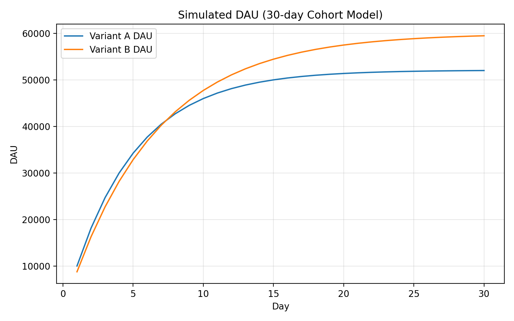
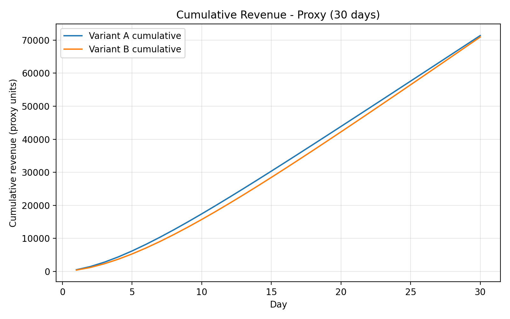

# Vertigo Games – Data Analyst Case

This repository contains my solution to the Vertigo Games Data Analyst case study.

The analysis evaluates two game variants (A and B) using cohort-based simulation, retention modeling, and revenue forecasting to determine both short-term and long-term performance.

---

# Objective

To determine:

- Which variant performs better in short-term monetization
- When break-even occurs
- Whether a temporary 10-day sale improves performance
- Whether a new permanent user acquisition source creates stronger long-term value
- Which strategic improvement should be prioritized

---

## Project Structure

```text
vertigo-data-analyst-case/
│
├── notebooks/
│ ├── 01_task1_ab_simulation.ipynb
│ └── 02_task2_eda.ipynb
│
├── src/
│ ├── config.py
│ ├── retention.py
│ ├── simulation.py
│ ├── revenue.py
│ └── viz.py
│
├── outputs/
│ └── figures/
│
└── README.md
```

- `src/` contains reusable simulation modules
- `notebooks/` contains structured analysis
- `outputs/figures/` stores exported visualizations

---

# Methodology

The analysis follows a structured modeling approach:

1. **Retention Curve Fitting**
   - Exponential decay model fitted to observed retention points.

2. **DAU Simulation**
   - Cohort-based user survival model.
   - DAU calculated as the sum of surviving users across all cohorts.

3. **Revenue Modeling**
   - IAP revenue = DAU × purchase rate
   - Ad revenue = DAU × impressions × eCPM / 1000
   - Cumulative revenue calculated over time.

4. **Cumulative Revenue Comparison**
   - Short-term (30 days)
   - Extended horizon (90 days)

5. **Scenario Analysis**
   - (d) 10-day temporary sale (+1% purchase rate)
   - (e/f) New permanent user source with improved retention
   - Evaluation under both 30-day and 90-day horizons

---

#  Assumptions

- Retention follows exponential decay.
- Purchase rate increase during sale does not affect retention.
- New source users follow provided retention formulas.
- Monetization parameters remain constant over time.
- No cannibalization effects between sources.

---

#  Task 1 – Key Findings

---

## (a) Daily Active Users

Variant B surpasses Variant A in DAU after approximately Day 15 due to slower retention decay.



---

## (b) Revenue by Day 15

By Day 15, Variant A generates higher cumulative revenue due to stronger early retention.

**Winner (Day 15): Variant A**



---

## (c) Revenue by Day 30

By Day 30, Variant A still leads in cumulative revenue, although the gap narrows as Variant B’s stronger long-term retention begins to compound.

**Winner (Day 30): Variant A**


---

## (d) 10-Day Sale Scenario

The 10-day sale increases purchase rate for both variants. However, Variant B benefits disproportionately from this temporary boost due to its slower retention decay.

While the sale lasts only from Day 15 to Day 24, the additional users monetized during this period remain active longer under Variant B’s retention curve. As a result:

The break-even day shifts earlier.

By Day 30, Variant B generates more cumulative revenue. İt is different outcome then before.

This shows that monetization improvements interact strongly with retention structure.

 

---

## (e) New Permanent User Source

Starting Day 20, daily installs are split into 12k users with the original retention curve and 8k users from a new source with a higher-quality retention model.

Under this mixed acquisition model, Variant A remains ahead in cumulative revenue by Day 30 and the gap vs. Variant B increases. This is consistent with Variant A’s stronger early retention (and higher ad impressions per DAU), which benefits more from the short 30-day horizon.

Compared to the 10-day sale scenario (Task 1d), total revenue is lower for both variants because the temporary purchase-rate uplift is not present in this scenario.


---

#  Final Recommendation (Task 1f)

If the KPI focus is short-term (30-day revenue):

→ Run the 10-day sale.

If the goal is long-term growth and LTV expansion:

→ Prioritize the new permanent user source.

While the temporary sale generates stronger short-term gains, structural retention improvements create substantially higher long-term enterprise value.

---

#  How to Reproduce

1. Clone repository
2. Create virtual environment
3. Install dependencies:
   pip install -r requirements.txt

4. Run Jupyter Notebook in `/notebooks`

All figures are saved under `outputs/figures/`.

---


##  Notes

- All figures are exported under `outputs/figures/`
- Code is modularized for clarity and reusability
- The analysis avoids horizon bias by evaluating scenarios under both 30-day and 90-day windows

---

##  Author

Enis Özcan  
Data Science & Analytics