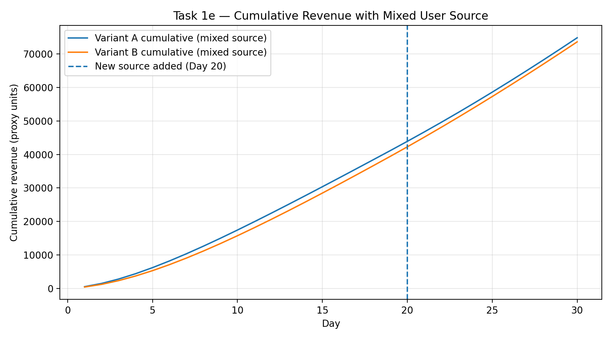
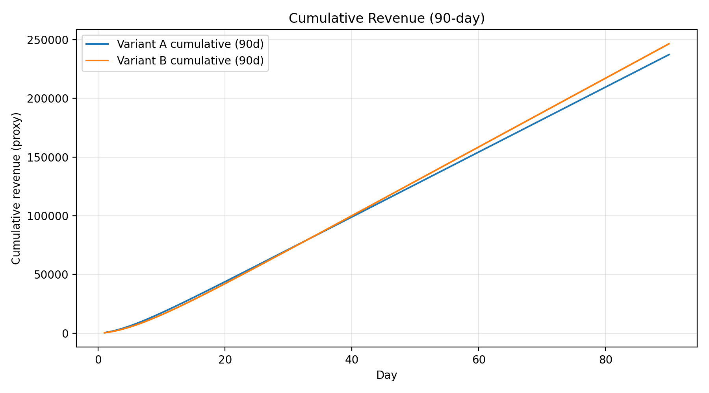
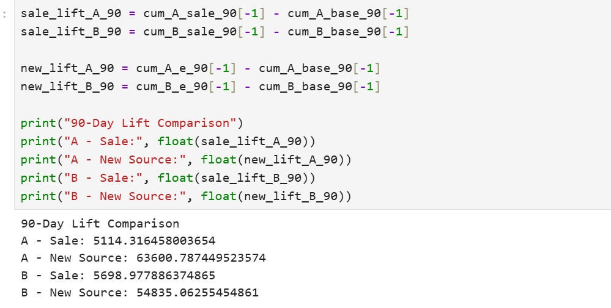

# Vertigo Games – Data Analyst Case

This repository contains my solution to the Vertigo Games Data Analyst case study.

## Project Structure

```text
vertigo-data-analyst-case/
│
├── data/
│ ├── raw/
│ ├── processed/
│
│
├── notebooks/
│ ├── 01_task1_ab_simulation.ipynb
│ └── 02_task2_eda.ipynb
│
├── src/
│ ├── config.py
│ ├── retention.py
│ ├── simulation.py
│ ├── revenue.py
│ └── __init__.py
│ └── cleaning.py
│ └── segmentation.py
│ └── features.py
│ └── io.py
│ └── task2_viz.py
│ └── viz.py
│ 
│ 
│
├── outputs/
│ └── figures/
│
└── README.md
```

- `src/` contains reusable simulation modules
- `notebooks/` contains structured analysis
- `outputs/figures/` stores exported visualizations

---

# Task 1 

The analysis evaluates two game variants (A and B) using cohort-based simulation, retention modeling, and revenue forecasting to determine both short-term and long-term performance.

---

# Objective

To determine:

- Which variant performs better in short-term monetization
- When break-even occurs
- Whether a temporary 10-day sale improves performance
- Whether a new permanent user acquisition source creates stronger long-term value
- Which strategic improvement should be prioritized

---


# Methodology

The analysis follows a structured modeling approach:

1. **Retention Curve Fitting**
   - Exponential decay model fitted to observed retention points.

2. **DAU Simulation**
   - Cohort-based user survival model.
   - DAU calculated as the sum of surviving users across all cohorts.

3. **Revenue Modeling**
   - IAP revenue = DAU × purchase rate
   - Ad revenue = DAU × impressions × eCPM / 1000
   - Cumulative revenue calculated over time.

4. **Cumulative Revenue Comparison**
   - Short-term (30 days)
   - Extended horizon (90 days)

5. **Scenario Analysis**
   - (d) 10-day temporary sale (+1% purchase rate)
   - (e/f) New permanent user source with improved retention
   - Evaluation under both 30-day and 90-day horizons

---

#  Assumptions

- Retention follows exponential decay.
- Purchase rate increase during sale does not affect retention.
- New source users follow provided retention formulas.
- Monetization parameters remain constant over time.
- No cannibalization effects between sources.

---

#  Task 1 – Key Findings

---

## (a) Daily Active Users

Variant B surpasses Variant A in DAU after approximately Day 15 due to slower retention decay.


---

## (b) Revenue by Day 15

By Day 15, Variant A generates higher cumulative revenue due to stronger early retention.

**Winner (Day 15): Variant A**


---

## (c) Revenue by Day 30

By Day 30, Variant A still leads in cumulative revenue, although the gap narrows as Variant B’s stronger long-term retention begins to compound.

**Winner (Day 30): Variant A**


---

## (d) 10-Day Sale Scenario

The 10-day sale increases purchase rate for both variants. However, Variant B benefits disproportionately from this temporary boost due to its slower retention decay.

While the sale lasts only from Day 15 to Day 24, the additional users monetized during this period remain active longer under Variant B’s retention curve. As a result:

The break-even day shifts earlier.

By Day 30, Variant B generates more cumulative revenue. İt is different outcome then before.

This shows that monetization improvements interact strongly with retention structure.


---

## (e) New Permanent User Source

Starting Day 20, daily installs are split into 12k users with the original retention curve and 8k users from a new source with a higher-quality retention model.

Under this mixed acquisition model, Variant A remains ahead in cumulative revenue by Day 30 and the gap vs. Variant B increases. This is consistent with Variant A’s stronger early retention (and higher ad impressions per DAU), which benefits more from the short 30-day horizon.

Compared to the 10-day sale scenario (Task 1d), total revenue is lower for both variants because the temporary purchase-rate uplift is not present in this scenario.



---

#  Final Recommendation (Task 1f)

If the KPI focus is short-term (30-day revenue):

→ Run the 10-day sale.

If the goal is long-term growth and LTV expansion:

→ Prioritize the new permanent user source.

While the temporary sale generates stronger short-term gains, structural retention improvements create substantially higher long-term enterprise value.

---
# 90-Day Analysis (Bonus)

To better understand the long-term dynamics, we extended the analysis to a 90-day horizon and compared all three scenarios:

- Baseline (original setup)
- Temporary 10-day sale
- New permanent user source

### Baseline Scenario
Under the original setup, the cumulative revenue curves reach a break-even point around Day 33. After this point, Variant B begins to generate higher cumulative revenue than Variant A due to its stronger long-term retention decay structure.



### Sale Scenario
The temporary 10-day sale accelerates revenue generation and shifts the break-even point earlier. However, this effect is short-lived. Since the sale does not modify the underlying retention curve, its long-term impact remains limited.

### New User Source Scenario
The introduction of a new permanent user source structurally improves retention characteristics. Although the short-term uplift is smaller than the sale scenario, the long-term revenue impact compounds significantly over time.

### Conclusion
While the sale provides a short-term monetization boost, the new user source generates stronger long-term value due to improved retention compounding. From a strategic perspective, structural retention improvements create more sustainable revenue growth than temporary monetization tactics.





# Task 2 Exploratory Analysis & User Segmentation


## Objective

The objective of Task 2 is to analyze user behavior patterns, engagement trends, monetization structure, and platform performance using real gameplay telemetry data.

### The analysis focuses on: ###

    User lifecycle behavior

    First-day engagement segmentation

    Retention differences between segments

    Revenue contribution by segment

    Country-level monetization potential

    Platform-level performance comparison

    Session duration trends over time

    Data Preparation & Engineering

To ensure clean and reproducible analysis, the workflow was modularized under the src/ directory.

### Data Loading ###
 
Multiple .csv.gz files were automatically loaded and concatenated using a reusable io.py module.

Data was stored at user-day level.

### Cleaning ###

Using cleaning.py:

Date columns parsed and standardized.

Numeric columns validated.

Missing country values handled.

Data types optimized for performance.

### Feature Engineering ###

Using features.py, additional analytical features were created:

total_revenue = iap_revenue + ad_revenue

days_since_install

victory_rate

avg_session_duration

conn_error_per_session

These features enabled lifecycle analysis and behavior-based segmentation.

### Cohort-Based First-Day Segmentation ###

To avoid bias from long-term legacy users, analysis focused on a new install cohort within the observed time window.

Users were segmented based on Day 0 (D0) behavior:

#### Segments Defined ####

IAP Monetizer – made in-app purchase on D0

Competitive – ≥5 matches and high victory rate

Highly Engaged – top 25% session duration

Casual – moderate engagement

Early Drop-off Risk – low sessions and low duration

#### Segment Distribution ####

Early Drop-off Risk: ~43%

Competitive: ~27%

Casual: ~26%

Highly Engaged: ~2.5%

IAP Monetizer: ~0.4%

This shows that nearly half of new users exhibit low first-day engagement.

### Retention Analysis (D1) ###

Retention strongly varies by segment:

IAP Monetizer: ~65%

Competitive: ~54%

Highly Engaged: ~49%

Casual: ~32%

Early Drop-off Risk: ~19%

#### Insight ####

Competitive behavior and early monetization strongly correlate with retention.
First-day engagement is highly predictive of next-day activity.

### Revenue Contribution by Segment ###

Revenue distribution across segments shows:

Competitive users generate the largest share of total revenue (~42%)

IAP Monetizers contribute ~38% despite representing <1% of users

Early Drop-off users contribute <7% of revenue

#### Strategic Insight ####

While whales (IAP Monetizers) generate high ARPU, Competitive users drive the largest portion of revenue due to their size and strong retention.

This suggests that strengthening competitive gameplay mechanics may yield scalable monetization improvements.

Session Duration Lifecycle Trends

Session duration was analyzed across days_since_install.

#### Findings: ####

Initial drop between Days 2–5

Gradual increase over time

Both mean and median trends increase

Interpretation

This indicates a healthy lifecycle pattern:

Early filtering of low-engagement users

Increasing engagement among retained users

Evidence of habit formation over time

Segment-based lifecycle analysis confirmed that Competitive and Monetizer users maintain consistently higher session duration.

### Country-Level Monetization Analysis ###

To prioritize potential localization investment, countries were evaluated based on:

User volume

Revenue contribution

ARPU

#### Key observations: ####

United States contributes the largest revenue share.

South Korea exhibits exceptionally high ARPU.

Brazil and Türkiye have high user volume but low ARPU.

#### Strategic Implication ####

South Korea represents a monetization-focused opportunity,
while Brazil and Türkiye offer scalable growth potential if localization improves retention and conversion.

Platform Performance Comparison (iOS vs Android)

Metrics analyzed:

User volume

Average session duration

Match completion rate

Win rate

Error rate

ARPU

#### Key findings: ####

Android has significantly larger user base.

iOS users demonstrate higher engagement and ~3x higher ARPU.

Technical stability (error rate and completion rate) is similar across platforms.

#### Strategic Insight ####

iOS is the stronger monetization platform,
while Android offers scale advantage and growth potential through engagement optimization.

### Overall Task 2 Conclusion ###

The analysis demonstrates:

First-day engagement strongly predicts retention and revenue.

Competitive behavior is a key monetization driver.

Revenue is not solely dependent on whales; engagement-driven segments contribute significantly.

Engagement increases over lifecycle among retained users.

Monetization strategies should differ across platforms and countries.

This structured approach integrates behavioral segmentation, lifecycle analytics, monetization modeling, and platform comparison to inform data-driven product decisions.


---

#  How to Reproduce

1. Clone repository
2. Create virtual environment
3. Install dependencies:
   pip install -r requirements.txt

4. Run Jupyter Notebook in `/notebooks`

All figures are saved under `outputs/figures/`.

---


##  Notes

- All figures are exported under `outputs/figures/`
- Code is modularized for clarity and reusability
- The analysis avoids horizon bias by evaluating scenarios under both 30-day and 90-day windows

---

##  Author

Enis Özcan  
Data Science & Analytics